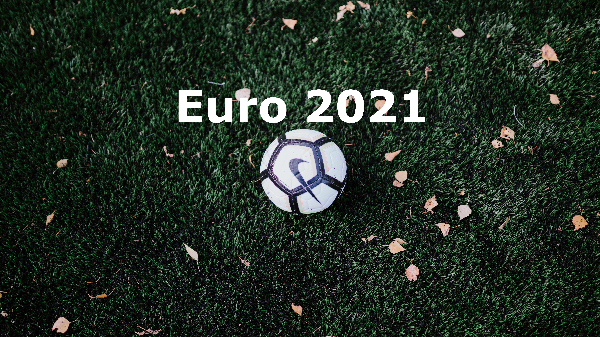

Do dịch bệnh Covid-19, vòng chung kết giải bóng đá EURO 2021 tại 12 quốc gia châu Âu sẽ chính thức diễn ra vào 12/6/2021.Hầu hết các trận đấu sẽ được miễn phí trên `ARD` hoặc `ZDF.`

Euro2020 có lẽ sẽ là một giải đấu không hề dễ dàng với đội tuyển quốc gia Đức vào thời điểm này. Đức nằm chung bảng F với những đối thủ rất mạnh là Pháp đương vô địch thế giới, Bồ Đào Nha đương vô địch Châu Âu, và Hungary. Munich và Budapest là 2 thành phố đăng cai các trận đấu của bảng này. Đây cũng là giải đấu cuối cùng của Joachim Löw trên cương vị HLV trưởng của đội tuyển quốc gia. Chúng ta hãy chờ xem đội tuyển Đức liệu thể hiện sức mạnh của mình như thế nào trong giải đấu này.
